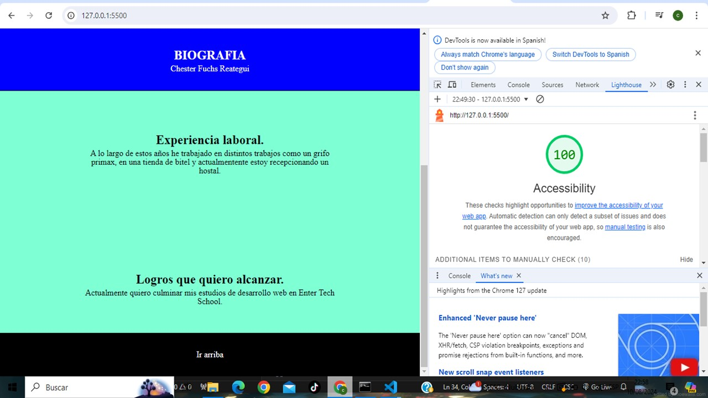
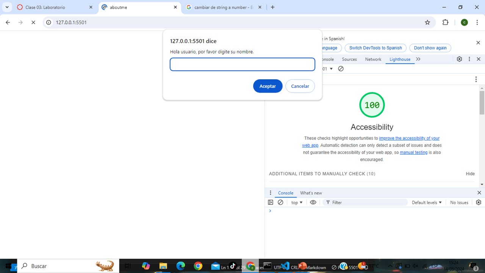

# LABORATORIO - Número 02

## Proyecto “About me”

Contruí una pagina web donde coloco mi biografia e interactuo con el usuario para que me puedan conocer mejor. Cumple con todo lo que se propone. Describiré su propósito y funcionalidad para que quienes lean mi README comprendan la pagina web.

### Autor: Chester fuchs

### Enlaces y Recursos
* [guia del proyecto](https://entertechschool.github.io/code-201-guide/curriculum/class-02/project-setup)
* [planilla del readme](https://entertechschool.github.io/code-201-guide/curriculum/class-02/README-template.html)
* [perfil](https://avatars.githubusercontent.com/u/175273601?v=4&size=64)

### Puntuación de Accesibilidad de Lighthouse

* 
* 

### Reflexiones y Comentarios

* Aprendi y logre entender algunas cosas que no estaban del todo claras, siento que es un buen comienzo aunque el tiempo me tomo un poco mas de lo esperado.
* siento que los retos estan ahi para estrezar a cualquiera y que esto aun es el comienzo.
* tengo que organizarme para hacer los envios previo a la hora designada.

